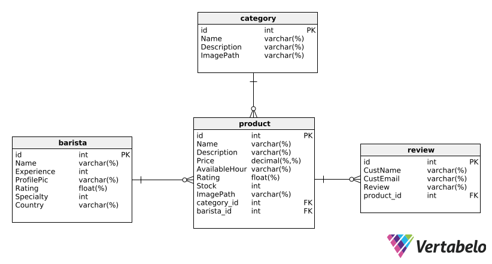
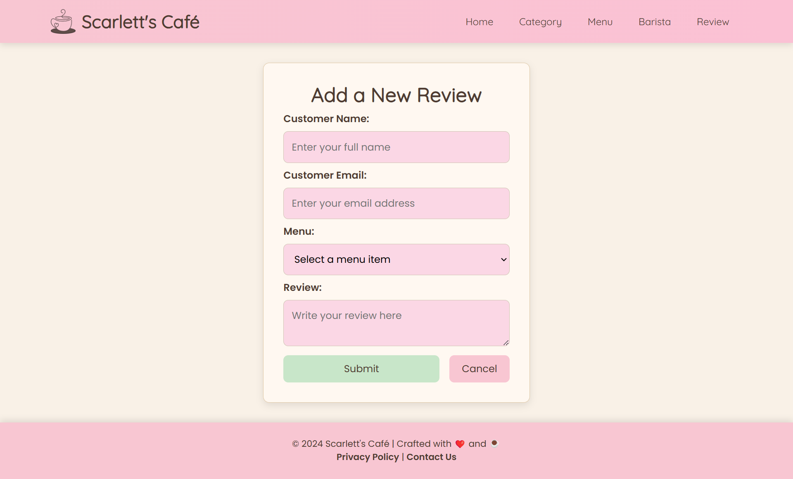

# 🌟 Final Project Go - Scarlett's Cafe  

## 📝 Group Information  
- *Group Number:* 9  
- *Class:* Pemrograman Berbasis Kerangka Kerja (D)  

## 👥 Group Members  

| Name                       | NRP         |  
|----------------------------|-------------|  
| Helsa Sriprameswari Putri  | 5025221154  |  
| Rayssa Ravelia             | 5025211219  |  

## 🌍 Project Overview  
For our final project in the Go framework course, we developed a website called **Scarlett's Cafe**, a cafe catalog. This website serves as an **ADMIN** role platform, allowing full **create, read, update, and delete (CRUD)** operations for all models. We selected a pink, girly theme to reflect the branding of Scarlett's Cafe.  

## 📽️ Demo Video  
Below is the demo video showcasing the key functionalities of this project:  

[](https://youtu.be/yO-bhszipl0)  
*Click the image to view the video.*  

## 💻 Tech Stack  
1. **Language:** GoLang  
2. **Framework:** Gin  
3. **Database:** MySQL  
4. **ORM:** GORM  

## ⚙️ Installation  
1. Clone the project from GitHub:  
   ```bash  
   https://github.com/rayrednet/Go-FP  
   ```  

2. Navigate to the project directory:  
   ```bash  
   cd Go-FP  
   ```  

3. Install project dependencies:  
   ```bash  
   go mod tidy  
   ```  

4. Configure the `.env` file with your MySQL credentials:  
   ```env  
   DB_USER=yourusername  
   DB_PASSWORD=yourpassword  
   DB_HOST=127.0.0.1  
   DB_PORT=3306  
   DB_NAME=fp_pbkk  
   ```  

5. Create the `fp_pbkk` database in MySQL:  
   ```sql  
   CREATE DATABASE fp_pbkk;  
   ```  

6. Run the project:  
   ```bash  
   go run main.go  
   ```  
   Access the project at [http://localhost:8080](http://localhost:8080).  

## 🛠️ Web App Features  

1. Add, update, and delete menus.  
2. Add, update, and delete menu categories.  
3. Add, update, and delete baristas.  
4. Add, update, and delete reviews.  

## 📊 Data Models  
1. **Conceptual Data Model**  
   

2. **Physical Data Model**  
   

## 🖼️ Web Pages Screenshot  

### 1️⃣ Homepage  
  
The homepage provides information about Scarlett's Cafe, including an "About Us" section, featured menus, our story, and location details.  

---

### 2️⃣ Category Section  
#### 2.a.Index Page  
  
Displays all available categories.  

#### 2.b. Create Page  
  
A form to add a new category. For example, the "Vegetarian" category was added here.  

  
The newly created "Vegetarian" category is added to the list.  

#### 2.c. Delete Category  
  
A confirmation popup appears before deleting the "Vegetarian" category.  

  
The "Vegetarian" category is successfully deleted.  

#### 2.d. Update Category  
  
Editing the "Cultural Delights" category.  

  
The form allows changes to the name, description, and image of the category.  

  
The updated "Cultural Voyage" category is now displayed.  

---

### 3️⃣ Menu Section  
#### 3.a.Index Page  
  
Lists all available menu items.  

  
Hovering over a menu item reveals more details.  

#### 3.b. Create Page  
  
A form to add a new menu item, such as "Mushroom Risotto."  

  
The form is filled with details for "Mushroom Risotto."  

  
The newly added menu item appears in the list.  

#### 3.c. Delete Menu  
  
The deletion process for "Mushroom Risotto."  

  
The menu item is successfully removed.  

#### 3.d. Update Menu  
  
Editing the "French Onion Soup" menu item.  

  
The form allows updates to the menu item's description, category, availability, stock, and image.  

  
The updated menu item in card view.  

  
The updated menu item in detail view.  

---

### 4️⃣ Barista Section  
#### 4.a.Index Page  
  
Lists all baristas.  

#### 4.b. Create Page  
  
A form to add a new barista, such as "Bella Hadid."  

  
The form is filled with details for "Bella Hadid."  

  
The newly added barista appears in the list.  

#### 4.c. Delete Barista  
  
Confirmation popup to delete "Bella Hadid."  

  
The barista is successfully removed.  

#### 4.d. Update Barista  
  
Editing "Amelia White" barista details.  

  
The form allows updates to the barista's details.  

  
The updated barista details are displayed.  

---

### 5️⃣ Review Section  
#### 5.a. Index Page  
  
Displays all reviews submitted.  

#### 5.b. Create Page  
  
A form to add a new review, such as Sarah Miller's review of Avocado Toast.  

  
The form is filled with details for the review.  

  
The newly added review appears in the list.  

#### 5.c. Delete Review  
  
The deletion process for Sarah Miller's review.  

  
The review is successfully removed.  

#### 5.d. Update Review  
  
Editing Emily Davis' review of Berry Smoothie Bowl.  

  
The updated details are entered into the form.  

  
The updated review appears in the list.  


## 📜 Conclusion  
In conclusion, **Scarlett's Cafe** showcases the power and flexibility of the Go framework combined with the Gin library for building robust web applications. Through this project, we implemented comprehensive CRUD functionalities and designed a visually appealing interface to manage cafe-related data efficiently. This project not only enhanced our technical skills but also taught us the importance of teamwork and project management.  

Thank you for exploring our project, and we hope you enjoyed learning about **Scarlett's Cafe**!  

